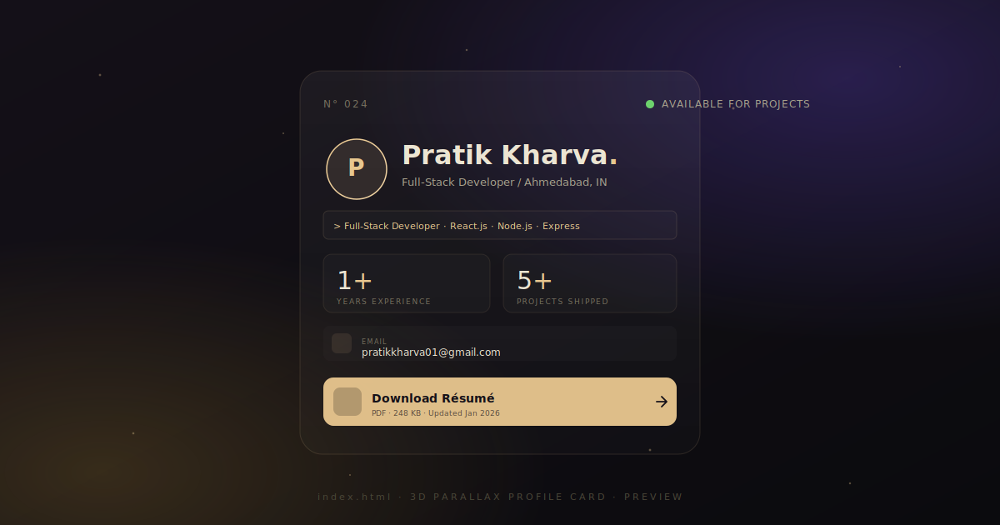
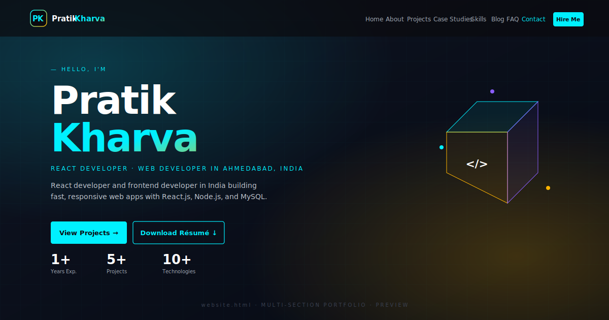

<div align="center">


# Pratik Kharva — Portfolio

**React developer portfolio · Web developer in Ahmedabad · Frontend developer in India**

Personal portfolio site. Static HTML / CSS / JS, no build step.

[Live site](https://pratikkharva.github.io/) · [3D card](./index.html) · [Full portfolio](./website.html) · [Résumé (PDF)](./PRATIK_KHARVA_.pdf) · [GitHub](https://github.com/pratik-kharva27) · [LinkedIn](https://linkedin.com/in/pratik-kharva-277143243)

</div>

---

## Previews

### 3D Parallax Profile Card — `index.html`

A single-page "business card" view with mouse-parallax tilt, specular highlight, floating tech-tag cloud, animated metrics, and a résumé download CTA. Supports dark + light themes.



> Replace `docs/preview-card.svg` with a real screenshot to make this the hero image. See [Screenshots](#screenshots) below for how to capture one at the right dimensions.

### Multi-Section Portfolio — `website.html`

Full developer portfolio: hero, about, projects grid with filters, case studies, skills tabs, blog teasers, FAQ, and contact form. Mobile-first, fully responsive, SEO-optimised.



> Replace `docs/preview-portfolio.svg` with a real screenshot. Hero dimensions are 1200 × 630 (matches Open Graph / Twitter Card size).

---

## What's inside

| File | Purpose |
|---|---|
| `index.html` | 3D parallax profile card (hero variant) |
| `website.html` | Full multi-section portfolio (hero, about, projects, case studies, skills, blog, FAQ, contact) |
| `style.css` + `script.js` | Assets for `index.html` |
| `website.css` + `website.js` | Assets for `website.html` |
| `pratik.jpeg` | Avatar + Open Graph image |
| `PRATIK_KHARVA_.pdf` | Downloadable résumé |
| `sitemap.xml` + `robots.txt` | Crawler directives |
| `SEO.md` | Full SEO strategy + off-page checklist |
| `docs/preview-*.svg` | Placeholder previews for this README |

## Features

- ⚡ **Zero-dependency**, zero-build — open in any browser
- 🎨 **3D parallax card** with mouse-tilt, specular highlight, particle background
- 📱 **Fully responsive** — tested down to 320 px viewports, iOS notch + Android gesture-bar aware
- ♿ **Accessible** — semantic HTML, skip link, ARIA labels, ≥44 × 44 tap targets, keyboard-focusable
- 🚀 **Performance** — preloaded LCP image, `fetchpriority="high"`, `content-visibility: auto` on offscreen sections, GPU cost reduced on low-power devices
- 🔍 **SEO-ready** — JSON-LD (`Person`, `ProfessionalService`, `Blog`, `FAQPage`), canonical URLs, OG + Twitter Cards, sitemap
- 🌓 **Dark / light theme** toggle on the card
- ✉️ **Progressive contact form** — tries a backend API, falls back to `mailto:`

## Tech stack

**Frontend:** HTML5, CSS3, vanilla JavaScript (no framework)
**Fonts:** Syne, DM Sans, JetBrains Mono, Fraunces, Outfit (Google Fonts, `display=swap`)
**Build:** None — ship the folder as-is

Content on `website.html` reflects my actual stack: **React.js · Node.js · Express · MySQL · MongoDB · GraphQL · Python · Git**.

## Run locally

Any static server. Pick one:

```bash
# Python 3
python3 -m http.server 8000

# Node (no install)
npx serve .

# PHP
php -S localhost:8000
```

Then open <http://localhost:8000/>.

## Deploy

Drop the folder onto any static host — no build step required:

- **GitHub Pages** — push to a repo named `<username>.github.io`, set *Settings → Pages → Source: main / (root)*
- **Netlify / Vercel / Cloudflare Pages** — drag-and-drop the folder
- **Any webserver** — just serve the directory

Before going live, open `SEO.md` and replace:
1. The placeholder base URL (`https://pratikkharva.github.io/`) in `sitemap.xml`, `robots.txt`, both HTML heads, and the JSON-LD graph.
2. The `google-site-verification`, `msvalidate.01`, `yandex-verification` tokens in both HTML `<head>`s.

## Screenshots

To replace the placeholder SVGs with real screenshots:

1. Start the local server above.
2. Open the page at **1200 × 630** (Chrome DevTools → device toolbar → set dimensions).
3. Capture full viewport:
   - **macOS:** <kbd>Cmd</kbd>+<kbd>Shift</kbd>+<kbd>4</kbd> then drag; or Chrome DevTools → ⋯ → *Capture screenshot*.
   - **Windows:** <kbd>Win</kbd>+<kbd>Shift</kbd>+<kbd>S</kbd>; or Chrome DevTools → *Capture screenshot*.
   - **CLI (headless Chrome):**
     ```bash
     chromium --headless --window-size=1200,630 --screenshot=docs/preview-card.png http://localhost:8000/index.html
     chromium --headless --window-size=1200,630 --screenshot=docs/preview-portfolio.png http://localhost:8000/website.html
     ```
4. Save as `docs/preview-card.png` and `docs/preview-portfolio.png`.
5. Update the image references in this README from `.svg` → `.png`.

Both files are used as the social-share (Open Graph) image — the 1200 × 630 dimension also matches the `og:image:width` / `og:image:height` meta tags, so Facebook / LinkedIn / Slack previews render crisply.

## Contact form

`website.html`'s form first attempts `POST /api/contact`. If no backend is reachable it falls back to opening the visitor's mail client with a pre-filled `mailto:` link — so submissions never fail silently.

To wire a real backend, replace the `fetch('/api/contact', …)` call in `website.js` with your provider:

- [Formspree](https://formspree.io) — zero-config, free tier
- [Netlify Forms](https://www.netlify.com/products/forms/) — free on Netlify, just add `data-netlify="true"`
- [Web3Forms](https://web3forms.com/) — free static-site form relay
- Any serverless function (Cloudflare Workers, Vercel Edge, AWS Lambda)

## SEO

Full strategy, implemented techniques, and the off-page checklist (Search Console submission, backlink building, analytics setup) live in [`SEO.md`](./SEO.md).

TL;DR of what's already in the code:
- Canonical URLs + `hreflang`
- `meta robots` per-bot directives
- Open Graph + Twitter Card tags
- JSON-LD schemas: `Person`, `WebSite`, `ProfilePage`, `ProfessionalService`, `BreadcrumbList`, `Blog`, `BlogPosting` ×3, `FAQPage`
- `sitemap.xml` + `robots.txt` with `Sitemap:` directive
- Preload hints, `fetchpriority`, safe-area, no horizontal overflow

## Accessibility

- One `<h1>` per page, proper heading hierarchy
- All interactive elements keyboard-focusable with visible focus ring
- `prefers-reduced-motion` respected (animations disabled)
- `prefers-reduced-data` respected (heavy effects skipped)
- Skip-to-content link on `website.html`
- All images have descriptive `alt` text
- Colour contrast meets WCAG AA in both dark + light themes

## Browser support

Modern evergreen browsers (Chromium, Firefox, Safari, Edge). `backdrop-filter`, `content-visibility`, `clamp()`, and `color-mix()` degrade gracefully on older versions.

## Contact

- **Email:** [pratikkharva01@gmail.com](mailto:pratikkharva01@gmail.com)
- **Phone:** +91 89801 26638
- **Location:** Ahmedabad, Gujarat, India
- **GitHub:** [@pratik-kharva27](https://github.com/pratik-kharva27)
- **LinkedIn:** [pratik-kharva-277143243](https://linkedin.com/in/pratik-kharva-277143243)

## License

Personal portfolio. Feel free to use the patterns, but please swap out the content, images, and contact details before deploying your own version.
